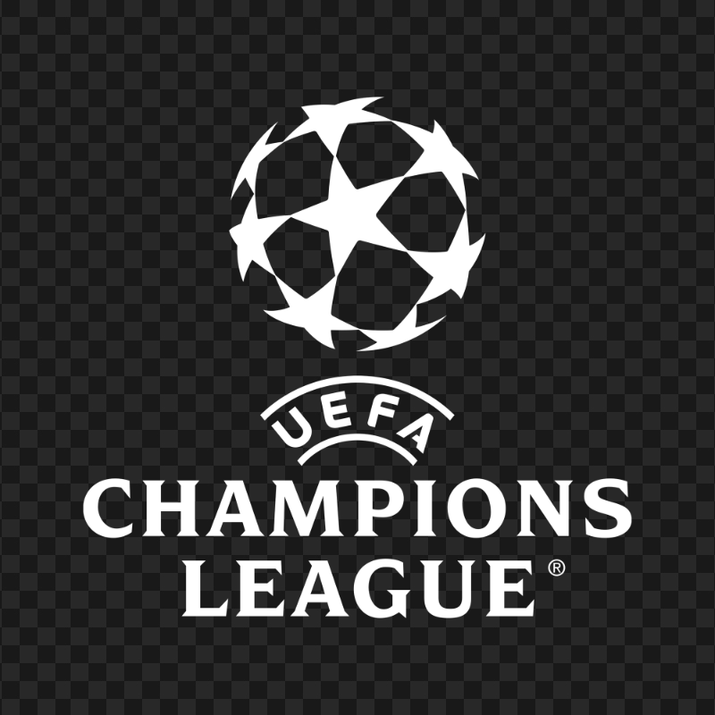

# ⚽ UEFA Champions League Analytics Dashboard

<p align="center">

  

  <h2 align="center">UEFA Champions League Analytics Dashboard</h2>

  <p align="center">
    An interactive data analytics dashboard exploring historical UEFA Champions League match results,
    team performance, goal trends, and match-level statistics.
  </p>

  <p align="center">
    <a href="YOUR_STREAMLIT_LIVE_LINK">
      
    </a>
    &nbsp;
    <a href="https://github.com/banerjee003/UCL-Data-Analysis">
      
    </a>
  </p>

</p>

---

## 🚀 Live Dashboard

### 👉 [Open the UEFA Champions League Analytics Dashboard](https://pallab-ucl-data-analysis.streamlit.app/)

Explore the dashboard interactively:

- Match outcome analysis
- Team performance
- Goal-scoring trends
- High-scoring games
- Match-level exploration
- Historical Champions League statistics

> **Note:** Replace `YOUR_STREAMLIT_LIVE_LINK` above with the actual Streamlit deployment URL.

---

## 📌 Project Overview

The **UEFA Champions League Analytics Dashboard** is an interactive data analytics project built to explore historical Champions League match data.

The project transforms raw match-level data into meaningful visual insights through an interactive **Streamlit dashboard**.

Instead of looking at isolated match records, the dashboard allows users to understand broader patterns such as:

- How often home teams win compared with away teams
- Which teams consistently perform well
- How goal-scoring patterns have changed across seasons
- Which matches produced the highest number of goals
- How a particular club performed across the available seasons
- Individual match results between teams

The project combines **Python, Pandas, data visualization, exploratory data analysis, Jupyter Notebook, and Streamlit** into a single interactive analytics application.

---

# 🎯 Objectives

The main objectives of this project are:

1. Analyze historical UEFA Champions League match results.
2. Understand home-win, away-win, and draw distributions.
3. Analyze team-level performance.
4. Identify goal-scoring trends across seasons.
5. Find high-scoring matches.
6. Provide an interactive team search and analysis experience.
7. Allow users to explore individual match records.
8. Present analytical findings through an intuitive dashboard.

---

# 📊 Dashboard Features

## 🏠 1. Overview

The Overview section provides a high-level summary of the dataset.

### Includes:

- Total matches
- Number of seasons
- Number of teams
- Total goals
- Average goals per match
- Home-win percentage
- Match result distribution
- Result breakdown
- Goals scored by season
- Key analytical insights

### Example analysis:

```text
Home Wins
Away Wins
Draws
Total Goals
Average Goals / Match
Home Advantage
